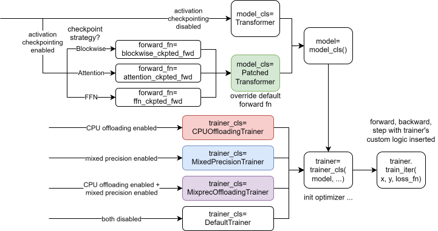

# MemOpt: Composition of Memory Optimizations for ML training

MemOpt supports the composition of 3 memory optimizations: activation checkpointing, mixed-precision training, and CPU offloading. When all 3 techniques are used, MemOpt can train a model that is 2.31x larger compared to the vanilla approach. [report.pdf](report.pdf) gives a detailed description and evaluation of MemOpt.

